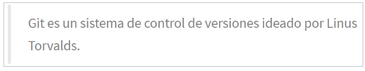
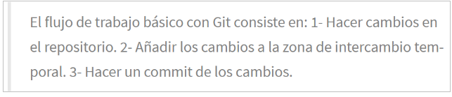

# Ejercicios de manejo del historial de cambios

Para hacer estos ejercicios es necesario haber hecho antes los ejercicios de creación y actualización de repositorios

## Ejercicio 1

1. Mostrar el historial de cambios del repositorio.
2. Crear la carpeta **capitulos** y crear dentro de ella el fichero **capitulo1.txt** con el siguiente texto:

    

3. Git es un sistema de control de versiones ideado por Linus Torvalds.
4. Añadir los cambios a la zona de intercambio temporal.
5. Hacer un commit de los cambios con el mensaje “Añadido capítulo 1.”
6. Volver a mostrar el historial de cambios del repositorio.

~~~
git log
mkdir capitulos
nano capitulos/capitulo1.txt
git add .
git commit -m "Añadido capítulo 1."
git log
~~~

## Ejercicio 2

1. Crear el fichero capitulo2.txt en la carpeta capitulos con el siguiente texto.
   
    

1. Añadir los cambios a la zona de intercambio temporal.
2. Hacer un commit de los cambios con el mensaje “Añadido capítulo 2.”
3. Mostrar las diferencias entre la última versión y dos versiones anteriores.

~~~
nano capitulos/capitulo2.txt
git add .
git commit -m "Añadido capítulo 2."
git diff HEAD~2
~~~

## Ejercicio 3

1. Crear el fichero capitulo3.txt en la carpeta capitulos con el siguiente texto.

       

2. Añadir los cambios a la zona de intercambio temporal.
3. Hacer un commit de los cambios con el mensaje “Añadido capítulo 3.”
4. Mostrar las diferencias entre la primera y la última versión del repositorio.

~~~
nano capitulos/capitulo3.txt
git add .
git commit -m
Añadido capítulo 3.
git diff 50e12f56b17d3b87150cb55245b0f83073d958e7 HEAD
~~~

## Ejercicio 4

1. Añadir al final del fichero indice.txt la siguiente línea:

    

2. Añadir los cambios a la zona de intercambio temporal.
3. Hacer un commit de los cambios con el mensaje “Añadido capítulo 5 al índice.”
4. Mostrar quién ha hecho cambios sobre el fichero indice.txt.

~~~
nano index.txt
git add .
git commit -m "Añadido capítulo 5 al índice"
git annotate indice.txt
~~~