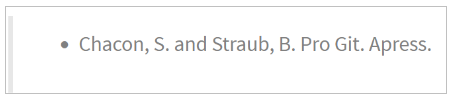
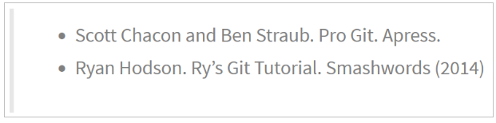
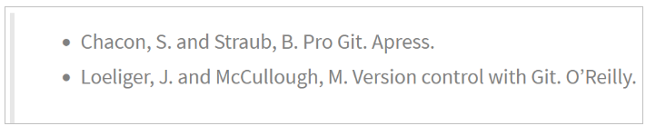
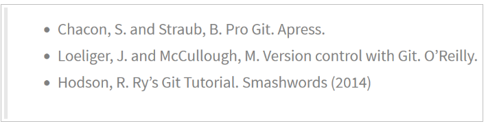

# Ejercicios de gestión de ramas

Para hacer estos ejercicios es necesario haber hecho antes los ejercicios sobre historial de cambios

## Ejercicio 1

Crear una nueva rama **bibliografia** y mostrar las ramas del repositorio.

~~~
git branch bibliografia
git branch -av
~~~

## Ejercicio 2

1. Crear el fichero capitulos/capitulo4.txt y añadir el texto siguiente

    

2. Añadir los cambios a la zona de intercambio temporal.
3. Hacer un commit con el mensaje “Añadido capítulo 4.”
4. Mostrar la historia del repositorio incluyendo todas las ramas.

~~~
nano capitulos/capitulo4.txt
git add capitulos/capitulo4.txt
git commit -m "Añadido capítulo 4."
git log --graph --all --oneline
~~~

## Ejercicio 3
    
1. Cambiar a la rama bibliografia.
2. Crear el fichero bibliografia.txt y añadir la siguiente referencia

    

3. Añadir los cambios a la zona de intercambio temporal.
4. Hacer un commit con el mensaje “Añadida primera referencia bibliográfica.”
5. Mostrar la historia del repositorio incluyendo todas las ramas.

~~~
git checkout bibliografia
nano bibliogrfia.txt
git add .
git commit -m "Añadida primera referencia bibliográfica."
git log --graph --all --oneline
~~~

## Ejercicio 4

1. Fusionar la rama **bibliografia** con la rama **master**.
2. Mostrar la historia del repositorio incluyendo todas las ramas.
3. Eliminar la rama **bibliografia**.
4. Mostrar de nuevo la historia del repositorio incluyendo todas las ramas.

~~~
git checkout master
git merge bibliografia
git log --graph --all --oneline
git branch -d bibliografia
git log --graph --all --oneline
~~~

## Ejercicio 5

1. Crear la rama **bibliografia**.
git branch bibliogragia
2. Cambiar a la rama **bibliografia**.
3. Cambiar el fichero **bibliografia.txt** para que contenga las siguientes referencias:

    

4. Añadir los cambios a la zona de intercambio temporal y hacer un commit con el mensaje “Añadida nueva referencia bibliográfica.”
5. Cambiar a la rama *master*.

6. Cambiar el fichero **bibliografia.txt** para que contenga las siguientes referencias:

    

7. Añadir los cambios a la zona de intercambio temporal y hacer un commit con el mensaje “Añadida nueva referencia bibliográfica.”
    
8. Fusionar la rama bibliografia con la rama master.

9.  Resolver el conflicto dejando el fichero bibliografia.txt con las referencias:

    

10.  Añadir los cambios a la zona de intercambio temporal y hacer un commit con el mensaje “Resuelto conflicto de bibliografía.”
11.  Mostrar la historia del repositorio incluyendo todas las ramas.

~~~
git branch bibliogragia
git checkout bibliografia
nano bibliografia.txt
git add .
git commit -m "Añadida nueva referencia bibliográfica."
git checkout master
nano bibliografía.txt
git add .
git commit -m "Añadida nueva referencia bibliográfica."
git merge bibliografia
nano bibliogra.txt
git add .
git commit -m "Resuelto conflicto de bibliográfia."
git log --graph --all --oneline
~~~